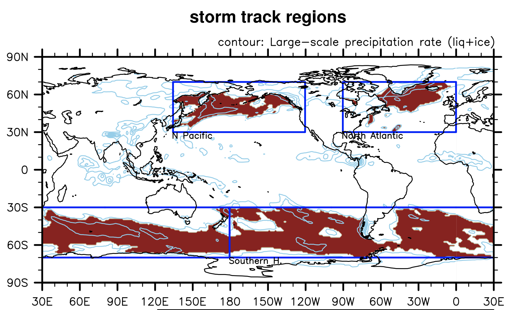

# Major Cloud regimes 

## Regimes classification
* regions that represent **ITCZ / storm track / stratocumulus** regimes are selected when
  - time-mean values meet the criteria listed below
  - matches with the regions presented in other literatures
* Note: only areas over ocean are considered.

|       | ITCZ | Storm Track | Stratocumulus |
|-------|------|-------------|---------------|
|location | 20ºS - 20ºN, 180ºW - 180ºE |- 30ºN – 70ºN, 90ºW – 0(North Atlantic)  - 30ºN – 70ºN, 135ºE – 120ºW (North Pacific)  - 70ºS – 30ºN, 180ºW – 180ºE (Southern Ocean) | - 10ºN – 25ºN, 150ºW – 120ºW (California)  - 25ºS – 5ºS, 105ºW – 80ºW (Peru - stratocumulus)  - 25ºS – 5ºS, 130ºW – 105ºW (Peru - trade cumulus)  - 25ºS - 10ºS, 80ºE – 110ºE (Australia)  - 30ºS - 0., 20ºW – 10ºE (Nambian)  - 20ºN – 50ºN, 40ºW – 15ºW (Canary) |
|criteria |convective precipitation (liquid + ice) greater than 3 x 10-5 mm/day |large-scale precipitation (liquid + ice) greater than 2 x 10-5 mm/day | regions with low-level cloud fraction greater than 30%  (trade cumulus region: regions with relatively less low-level cloud fraction than stratocumulus regions)|
| | | ||
| | | | |
 
