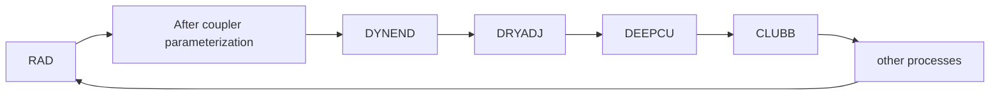
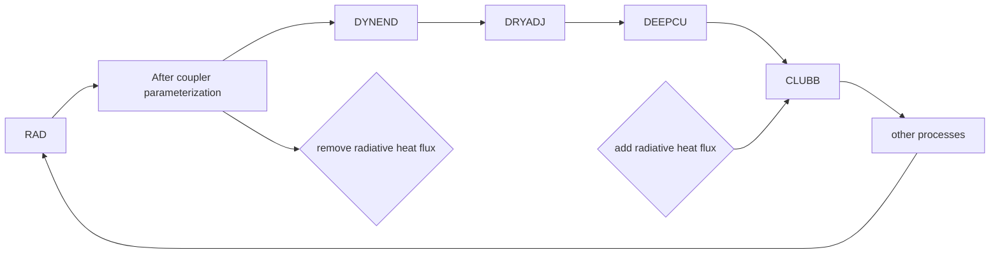
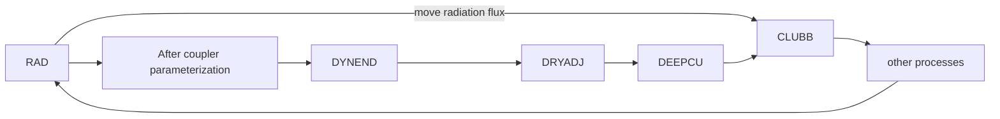
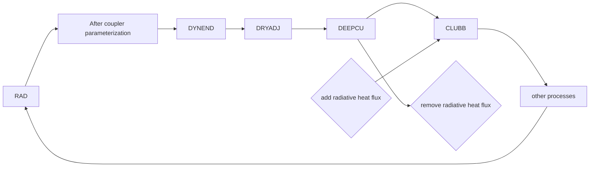

# General Info
* start date: 2022.Jan.28

## Simulation settings
* ctrl setting

* test setting

* test2 setting

* test3 setting


### Experiments
* Control: `radheat_cpl_opt = 0`
* Test run: `radheat_cpl_opt = 2`
* Test2 run: `radheat_cpl_opt = 1`
* Test3 run: `radheat_cpl_opt = 3`

### Common settings for CondiDiag

| Checkpoint | Process |
|------------|---------|
| IONDRAG    | All "after-coupling" parameterizations |
| ACRADRVT   | Subtracting radiation dT/dt (for test sim.) |
| DYNEND     | Dynamics |
| DRYADJ     | Dry adjustment and a few small things |
| DEEPCU     | Deep convection |
| BCRADADD   | Adding back radiation dT/dt |
| CLUBBxx    | xx = 01,...,06, CLUBB |
| CUDETxx    | xx = 01,...,06, detrainment |
| CLDMICxx   | xx = 01,...,06, cloud microphysics |
| AERWETRM   | Aerosol wet removal and conv. transport |
| RAD        | Radiation |


```
qoi_name = 'T','Q','CLDLIQ','CLDICE','CLOUD','CAPE'
qoi_nver =  72, 72,      72,      72,     72,   1

l_output_state = .true.
l_output_incrm = .true.
```

## General explanation about the simulation
* remove the radiative heating effect during deep convection parameterization to reduce the deep convection
* Questions
    * [ ] When deep convection becomes weaker, how CLUBB will react?
    * [ ] Why CLUBB is not as active? -> check CAPE
        - CLUBB is decreasing in Sc region
            - less condensation?
            - less cloud top cooling reduces the strength of CAPE (less positive feedback?)?


## Analysis
* radiation flux is removed after 'IONDRAG' check point.
* Dynamical core → dry adjustment → deep convection process exprience hotter atmosphere
    * Changes in temperature may change [synoptic-scale pressure systems and wind patterns](https://compy-dtn.pnl.gov/kima320/Budget_Analysis/With_forcing_method/Difference/map_of_PSL_cape_u.pdf).
    * Dynamic core advects
        * less heat near the Panama (less warm advection: see [temp. adv.](https://compy-dtn.pnl.gov/kima320/png_plot/Budget_Analysis/01_global/DYNEND_temp_adv.png) and [surface zonal wind](https://compy-dtn.pnl.gov/kima320/Budget_Analysis/With_forcing_method/Difference/map_of_cld_cape_u.pdf))
        * less heat near Eastern Pacific, more heat near Bering Sea (Less impact on CAPE because CAPE is not strong around these areas)
    * For that reason, [CAPE](https://compy-dtn.pnl.gov/kima320/png_plot/Budget_Analysis/02_zm_rad_modification/ctrl/CAPE_vertical_integral_by_variable_and_add_substeps-3.png) changes after the Dynamic core
    * ^^stratocumulus region^^: subsidence increases during DYNEND (warm region shifted downward)
        - the cloud layer becomes more stable: see [CLUBB turbulence terms](https://compy-dtn.pnl.gov/kima320/png_plot/Budget_Analysis/02_zm_rad_modification/differences/Diff_Vertical_profiles_of_single_Variable-2.png)
        - [Thinner PBL](https://compy-dtn.pnl.gov/kima320/Budget_Analysis/With_forcing_method/Difference/map_of_PBL.pdf)
* compensating amount of [CAPE from DYNEND changes during DEEPCU](https://compy-dtn.pnl.gov/kima320/png_plot/Budget_Analysis/02_zm_rad_modification/ctrl/CAPE_vertical_integral_by_variable_and_add_substeps-5.png)
    * Detrainment decreases (but Q does not change during CUDET in this model)
* radiation flux tendency is added again right before CLUBB, and [CAPE increases](https://compy-dtn.pnl.gov/kima320/png_plot/Budget_Analysis/02_zm_rad_modification/ctrl/CAPE_vertical_integral_by_variable_and_add_substeps-6.png)
    * stratocumulus region
        * new cloud top (where it was used to be the cloud layer) is cold again,
            - less inversion in the new cloud top.
            - seems to be that the temerature decrease in the cloud layer did not affect CLUBB turbulence much due to cold surface temperature.
        

* during RAD, temperature around the new cloud top decreases
    * trade wind cumulus region
        * during DYNEND, subsidence increases, but not as strong as in Peru stratocumulus region.
        * deep convection near cloud top decreases because this layer is stable now
        * PBL decreases
        * before CLUBB, cloud layer is cold again,


